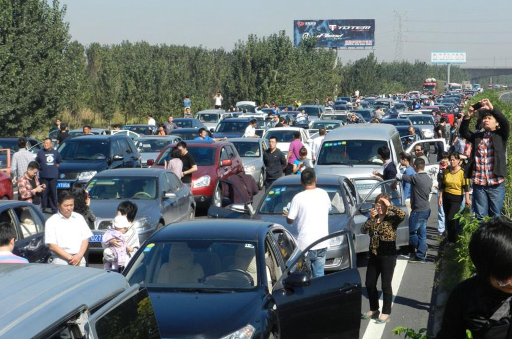
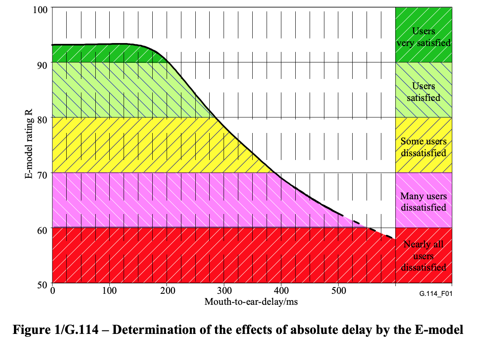
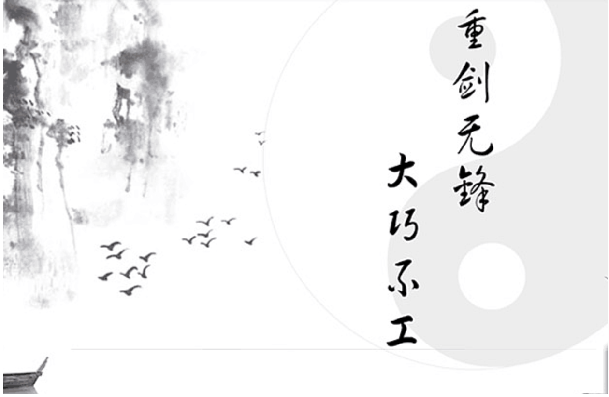
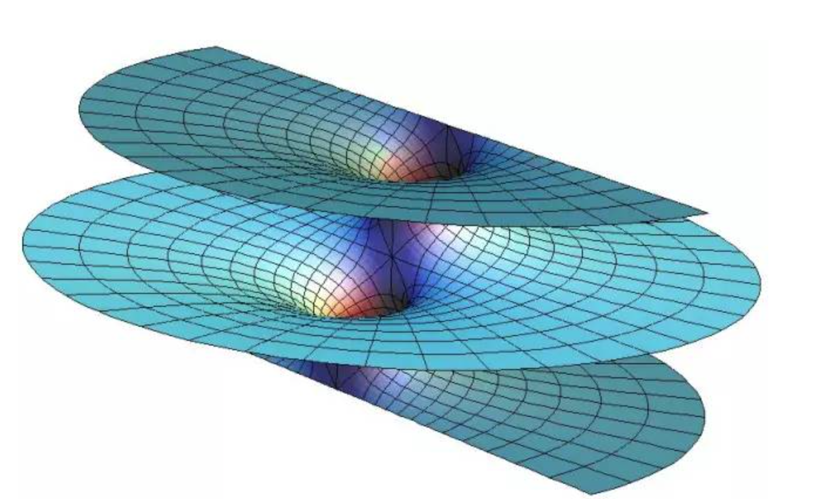

# 漫谈RTC拥塞控制

## 什么是网络拥塞
 现在每逢节假日高速公路免费的时候， 上路的车辆会大量增加， 各种走向的车辆相互干扰， 导致交通拥堵的发生，人们看着一望无际的堵在路上的车流， 绝望之情油然而生.  发生堵车后， 每辆车到达目的地的时间就会随之增加， 甚至可能会因堵塞而无法开动， 发生局部死锁. 这跟互联网的拥塞是极为相似的.
 
 
 互联网也被称为信息高速公路， 如果把每个网络包看作是上路的汽车， 互联网的交通状况比现实中的公路网更加复杂.  数据包从一个端发往另一个端， 可能会经历通行状况良好的高速公路， 也可能会有蜿蜒崎岖的山路， 也可能会遇到节假日那样大堵车.  跟公路网堵车类似， 网络拥塞会导致数据包到达目的时间变长（时延增加),  每个包到达所需要的时间不同（网络抖动， 乱序）, 跟公路网堵车不同的是: 一般上路的汽车不会无缘无故的消失， 但是网络上的数据包则可能在通过某个网络节点时， 被节点丢弃， 丢包的发生是没有任何通知的，对于发送和接收终端而言, 丢包的发生是无缘无故的. 如果接收终端坚持要等待某个被丢弃数据包的到达， 就算是海枯石烂， 它也无法得偿所愿， 如果在设计上没有很好的处理丢包异常，它就会无法工作变为望夫石.  
 有了初步印象, 我们就可以得出网络拥塞的定义了:  网络拥塞是网络节点/链路所承载的数据量超过了它所能处理的极限, 从而导致的网络服务质量的下降.
 
## RTC系统如何应对网络拥塞
  实时的音视频通讯系统对用户体验有极高的要求, 除了音视频本身的高质量和流畅之外, 对时延也有极高要求， 通常认为， 端到端时延低于200ms的时候， 使用者满意度极高， 端到端时延低于300ms， 使用者会比较满意，当端到端时延介于300ms于400ms之间的时候， 会有部分使用者对通讯质量觉得失望， 当端到端时延大于400ms时， 多数使用者都会失望， 当端到端时延大于550ms时， 几乎所有使用者都会认为不可接受.
 
  网络拥塞造成的丢包，延时和抖动， 势必导致导致实时通讯中音视频的质量降低，卡顿和时延增加. 尤其是丢包， 更是音视频卡顿的最直接的原因. 那么要如何应对网络拥塞， 让RTC系统保持较好的用户体验呢？ 
 
 
 倚天屠龙记中张无忌学习太极剑， 一代宗师张三丰循循善诱， 指导张教主忘掉剑招， 只记剑意,  从而战胜手持倚天剑的八臂神剑东方白.  这就是功夫的最高境界无招胜有招.  在RTC系统设计中， 诚然有很多招数可以应对弱网， 但是最佳的做法确是要避免使用这些招数， 无招胜有招， 避免网络拥塞的出现.
* 就近接入： 当汽车出发开始远程跋涉的时候， 通常都要看最近的高速路口在哪儿， 减少在山区小路或者市区线路上的时间.  RTC系统应对网络拥塞， 首要就是根据用户终端的所在地选择最佳的接入点, 让用户的数据包尽快到达高速线路上， 降低在用户接入点拥塞发生的可能性.
* 智能路由： 现在的导航软件大多集成了实时路况的监控， 汽车从起点到终点，可以选择的路线会有多条， 优秀的导航算法不仅仅可以在出发的时候根据实时路况， 选择最优路径， 在汽车形势的过程中， 还可以动态规划线路， 保证汽车行驶过程中一直沿最优路径行驶.  RTC系统中，也会有这样的动态规划线路的大脑.  实时监视着每条道路上的路况情形， 是否有拥塞， 然后根据实时路况选择数据包的路径.
 
* 带宽预测: 在音视频通讯过程中， 为了提高音视频的质量， 会希望增加音视频编码的码率， 但是实际系统中带宽往往有带宽瓶颈， 增加传输的数据， 就可能会遇到瓶颈， 造成网络拥塞， 导致实际质量的下降. 为了避免这种情形的发生， 就需要对网络的瓶颈做准确的评估， 但是互联网是一个动态系统， 它的瓶颈是时时在变化的， 这也就意味中， 在整个通讯的过程中都需要估计网络的带宽， 避免数据超发造成网络拥塞.

实际应用场景比较复杂， 就算用了很多方法来规避网络拥塞，但是依然无法完全避免拥塞的发生,  这时候就需要有一些抵抗弱网的手段.  常见的做法有丢包重传和前向纠错编码来抵抗丢包.  自适应的JitterBuffer来抵抗网络时延的抖动和包乱序.  还有一些结合整条处理链路，从编码解码器的策略调整来应对的方案.  不过所有抵抗弱网的手段都是利弊共存， 如何应用是非常关键的.  而且在整条处理链路上， 各个模块相互依赖， 相互影响.  为了保证整条链路工作的鲁棒性， 避免出现正反馈震荡,  更是设计之重.   
 
 
## Reference
* https://en.wikipedia.org/wiki/Network_congestion
* ITU-T Rec. G.114 One-way transmission time
